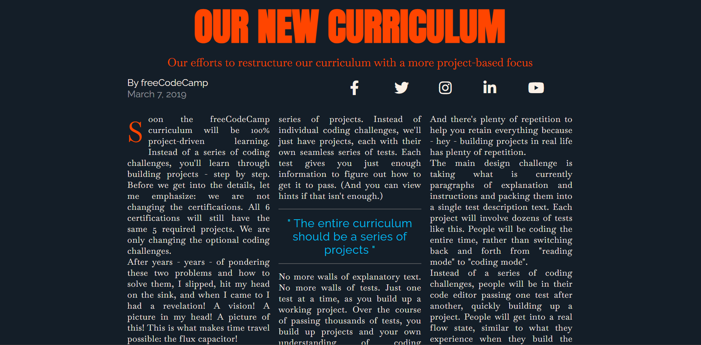

# 📰 Magazine Layout

A **magazine-style web layout** built using **HTML and CSS** as part of my **FreeCodeCamp learning journey**.

This project focuses on layout design, typography, spacing, and structuring content similar to a real digital magazine.

---

## 🚀 Features
- Clean magazine-style layout  
- Well-structured sections and typography  
- Built using pure HTML and CSS  
- Responsive and readable design  

---

## 🖼 Screenshot


---

## 🌐 Live Demo
View the project live here:  
https://sadiapuspita.github.io/magazine/

---

## 🛠 Technologies Used
- **HTML** – Page structure and content  
- **CSS** – Layout, typography, spacing, and styling  

---

## 💻 How to Run Locally
1. Clone the repository:
```bash
git clone https://github.com/sadiapuspita/magazine.git
